# 🎓 Rapport de Stage / Internship Report: Mahkama Intern Manager
## نظام إدارة المتدربين - وزارة العدل / المحكمة

---

## 📌 1. Executive Summary & Project Overview

The **Mahkama Intern Manager (نظام إدارة المتدربين)** is an end-to-end, enterprise-grade intern management platform developed specifically for the Court / Ministry of Justice environment. It streamlines the lifecycle of intern management—from initial application submission and document vetting to supervisor assignment, daily attendance tracking, automated document requests, and formal completion certification.

### Key Objectives
* **Digitization & Automation:** Replace paper-based intern tracking with digitized profiles, automated form generation, and electronic document workflows.
* **Role-Based Security:** Enforce strict access control across three user tiers: Administrators, Department Managers/Supervisors (Encadrants), and Interns.
* **Seamless Deployment:** Provide one-click deployment via Docker and standalone Electron Desktop execution.

---

## 🏗️ 2. System Architecture & Technology Stack

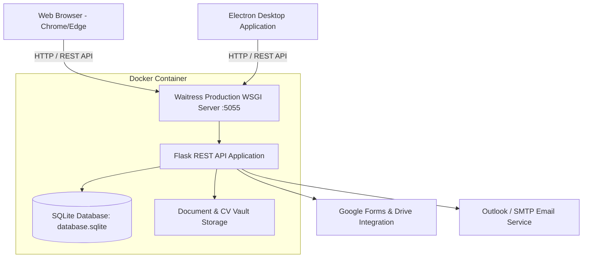

### Technology Breakdown
* **Frontend:** React 19, TypeScript 5.7, Vite 8, Phosphor Icons, Modern RTL CSS Design System.
* **Backend:** Python 3.10, Flask, SQLAlchemy, Flask-JWT-Extended, Flask-CORS.
* **Database & Storage:** SQLite with Write-Ahead Logging (WAL) for concurrent read/write performance.
* **Desktop & Containerization:** Electron 34, Docker Desktop (Multi-stage build), Waitress WSGI Server.

---

## 👥 3. Role-Based Access Control (RBAC)

The application enforces strict permission boundaries across three primary roles:

| Role | Access Level | Description |
| :--- | :--- | :--- |
| **Admin (مدير النظام)** | Full Access | Can manage all interns, system users, permission grants, global settings, Google/Outlook integrations, and document approvals. |
| **Manager (مدير قسم / مؤطر)** | Granular Access | Department supervisors with customizable permission flags (`interns.view`, `attendance.view`, `vault.view`, `documents.manage`). |
| **Intern (متدرب)** | Self-Service Portal | Restricted to viewing their personal internship status, uploading requested documents, and downloading signed agreements. |

---

## 📸 4. Complete Interface Showcase & Page Breakdown

---

### 🛡️ Section 4.1: Admin Portal (مدير النظام)

#### 1. Executive Dashboard (`/`)
The main command center displays real-time key performance indicators (KPIs), pending registration requests from Google Forms/portal submissions, urgent tasks, and intern distribution charts.

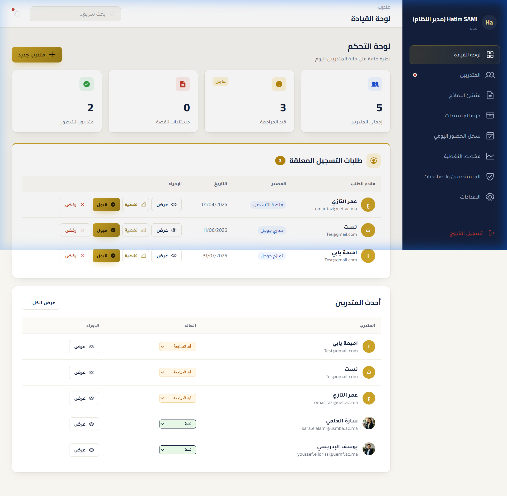

* **Key Features:**
  * **Metric Counters:** Total interns, urgent tasks, pending reviews, missing documents, active interns.
  * **Pending Applications Drawer:** Quick action buttons (View, Approve, Reject with custom email notifications).
  * **Capacity & Department Distribution:** Real-time visual progress bars indicating intern allocation across court departments.

---

#### 2. Interns Directory (`/interns`)
A comprehensive database of all interns registered in the system with status filters, search, and bulk export capabilities (PDF summary & Excel export).

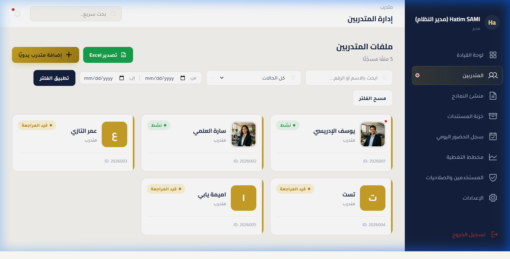

* **Key Features:**
  * **Status Pills:** Active (نشط), Pending Review (قيد المراجعة), Completed (مكتمل).
  * **Quick Search:** Instant search by name, national ID (CIN), university, or department.
  * **Export Tools:** Export filtered lists to Excel spreadsheet or downloadable PDF reports.

---

#### 3. Detailed Intern Profile & Evaluation (`/interns/:id`)
A complete 360-degree view of an individual intern, including identity details, assigned supervisor (Encadrant), uploaded documents, attendance history, and formal performance evaluation scores.

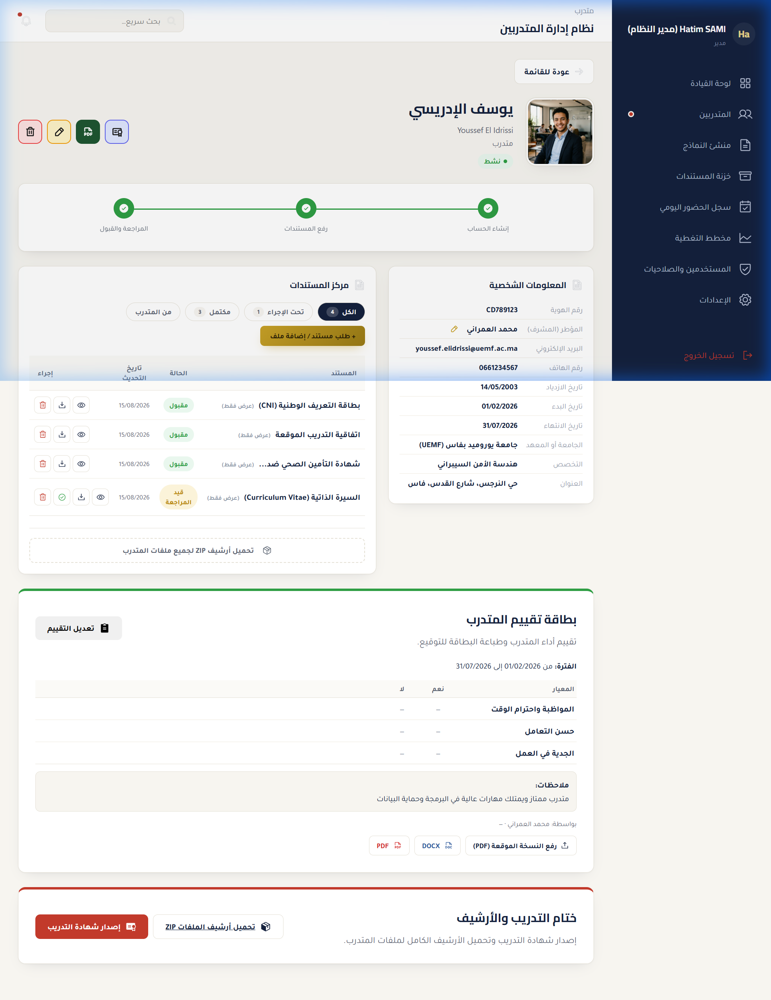

* **Key Features:**
  * **Identity Card:** Photo, French & Arabic full names, National ID, university, and specialty.
  * **Document Lifecycle:** Uploaded CIN, insurance, signed agreements, and document approval queue.
  * **Evaluation Grid:** 5-criteria performance score matrix (Discipline, Technical Skills, Teamwork, Initiative, Quality) out of 20 with supervisor comments.

---

#### 4. Form Builder (`/form-builder`)
An integrated form creation studio allowing administrators to build public registration forms, generate Google Forms automatically, and manage incoming applications.

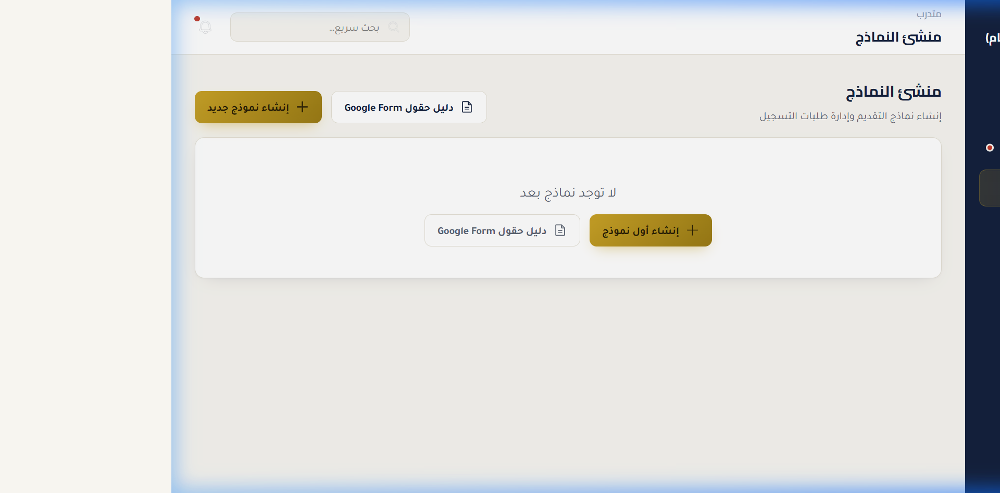

* **Key Features:**
  * **Custom Fields:** Drag-and-drop or configure text, select, date, and file upload fields.
  * **Google Forms Sync:** Auto-sync application submissions directly from connected Google Forms.
  * **Public Link Generation:** Generate shareable registration links for universities and candidates.

---

#### 5. Document Vault (`/vault`)
A centralized, secure digital repository for storing official court document templates, intern CVs, conventions, and signed certificates.

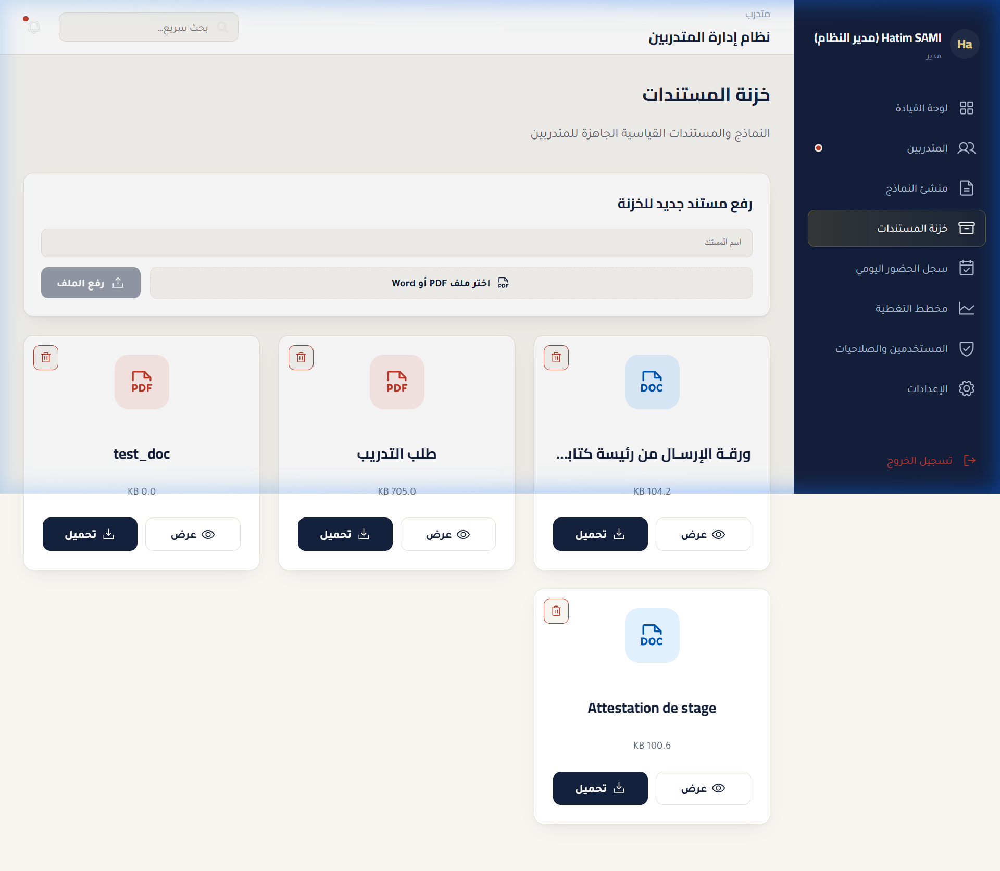

* **Key Features:**
  * **Category Filter:** CVs, National IDs (CIN), Training Agreements (اتفاقية التدريب), Certificates (شهادة التدريب).
  * **Document Actions:** Direct download, preview, and administrative approval.

---

#### 6. Daily Attendance Register (`/attendance`)
An interactive daily attendance logger and calendar tracking intern presence, absences, and authorized leaves.

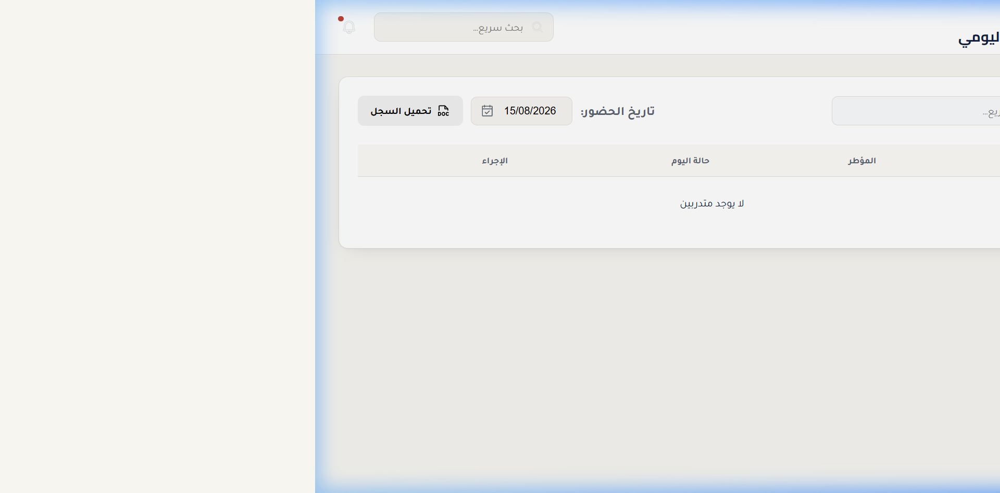

* **Key Features:**
  * **Daily Quick Check:** One-click attendance status marking (Present / Absent / Excused).
  * **Monthly Summary Table:** Cumulative presence counter per intern for attendance certificate generation.

---

#### 7. Timeline & Coverage Planner (`/timeline`)
A Gantt-style timeline visualization tracking internship start and end dates to ensure department coverage and avoid overcrowding.

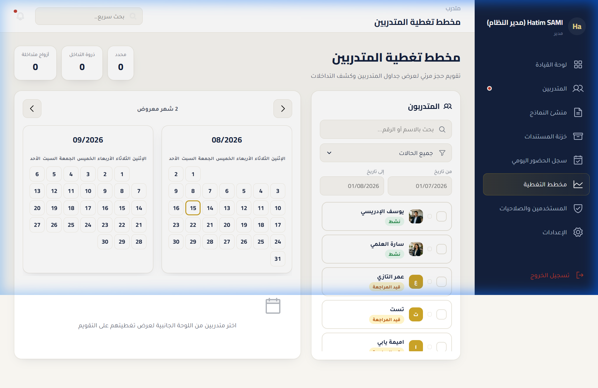

* **Key Features:**
  * **Gantt Visualization:** Horizontal timeline bars illustrating active internship durations.
  * **Overcrowding Indicators:** Highlights peak months with high intern density per department.

---

#### 8. Users & Permissions Manager (`/users`)
An administrative control panel for creating staff accounts, assigning roles (Admin vs. Manager), and setting fine-grained permission toggles.

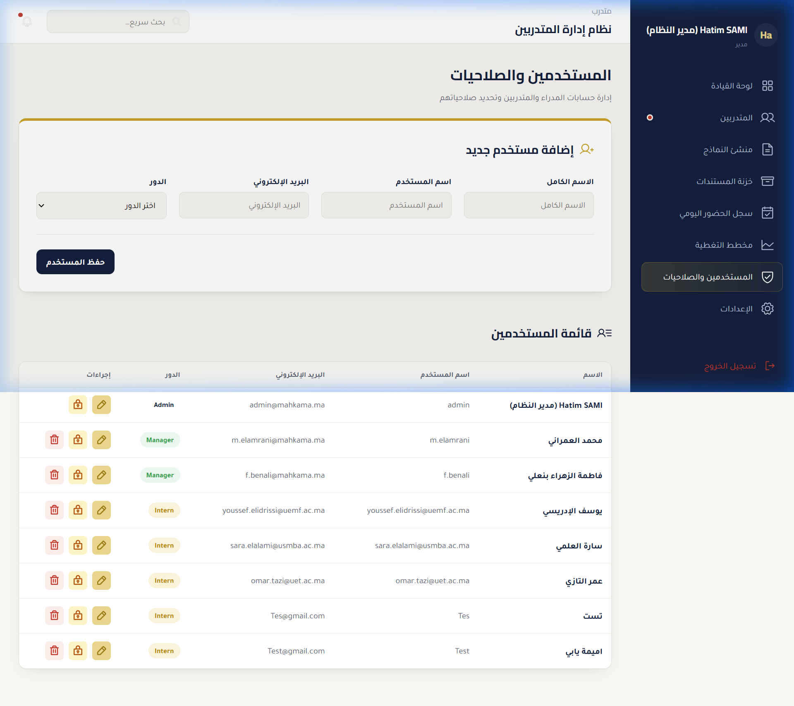

* **Key Features:**
  * **Account Creation:** Add new department managers with custom usernames and passwords.
  * **Permission Matrix:** Toggle specific access rights (`interns.view`, `attendance.view`, `vault.view`, `documents.manage`).

---

#### 9. Global System Settings (`/settings`)
Configuration dashboard for managing email server connections (Outlook/SMTP), Google API credentials, backup management, and audit logs.

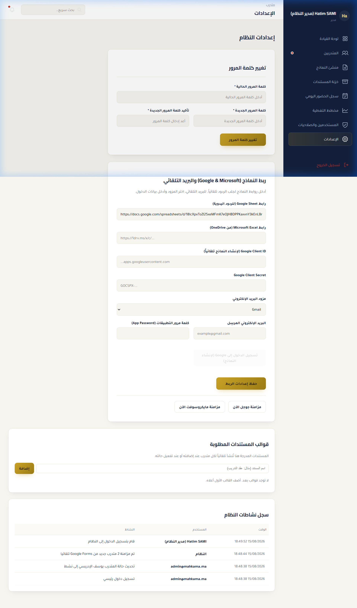

* **Key Features:**
  * **Email Integration:** Configure Microsoft Outlook / Gmail SMTP parameters for automated email delivery.
  * **Google Service Account:** Setup Google Drive & Sheets API sync tokens.
  * **System Audit Log:** Complete event log recording security events, logins, and status updates.

---

### 👨‍💼 Section 4.2: Manager Portal (مدير قسم / مؤطر)

When a Department Manager (e.g. `m.elamrani`) logs into the system, the interface dynamically adjusts according to their assigned permissions. 

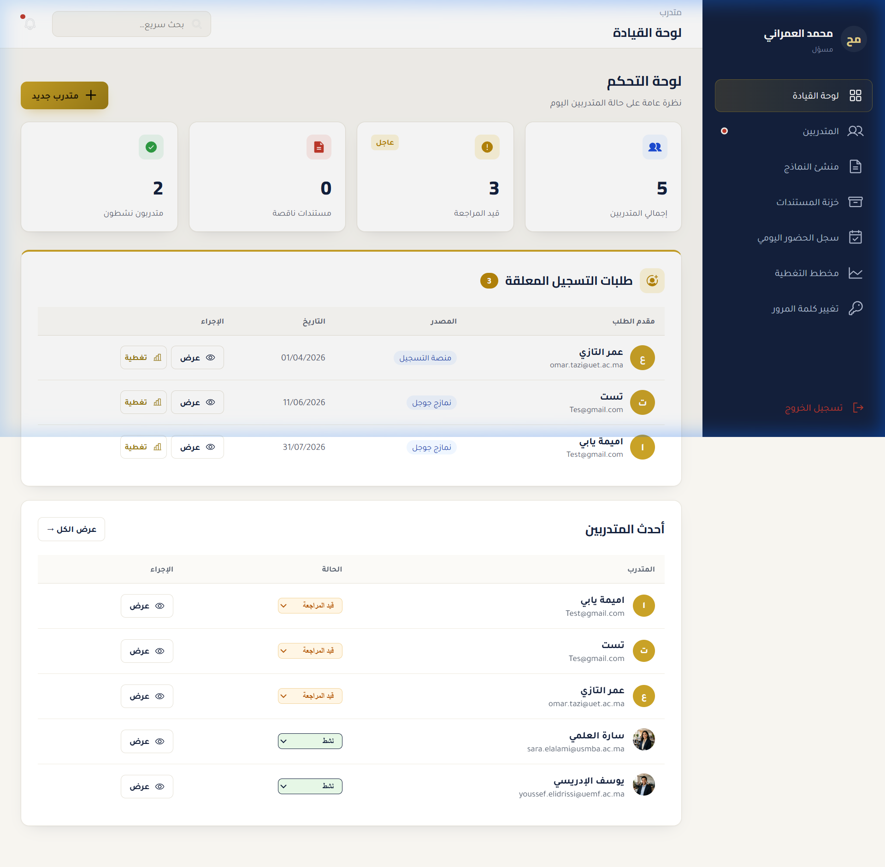

* **Key Features:**
  * **Scoped Visibility:** Managers only view interns assigned to their department or encadrant supervision.
  * **Restricted Navigation:** Administrative tabs (Users, System Settings, Form Builder) are automatically hidden based on RBAC rules.
  * **Direct Evaluation:** Encadrants can enter performance scores and sign off on intern completion.

---

### 🎓 Section 4.3: Intern Portal (بوابة المتدرب)

When an intern (e.g. `youssef.elidrissi@uemf.ac.ma`) logs into the portal, they are presented with a clean, personal dashboard tailored specifically to their internship requirements.

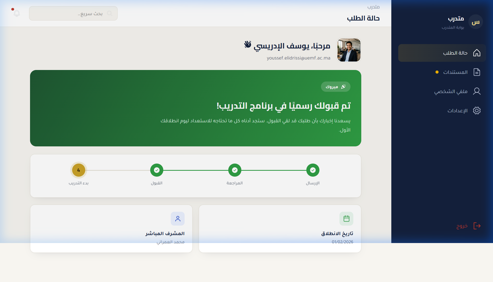

* **Key Features:**
  * **Personal Status Card:** Live status tracking (Active, Pending Documents, Completed).
  * **Document Upload & Download:** Upload required identity files (CIN, Insurance) and download officially approved & signed internship certificates.
  * **Document Requests:** Receive and fulfill custom document requests issued by administration.

---

## ⚡ 5. Deployment & Execution Instructions

### Option 1: One-Click Production Server (Docker)
1. Extract the project archive to `C:\Mahkama_App`.
2. Right-click **`start_app.bat`** and choose **"Run as Administrator"**.
3. The script automatically installs Docker Desktop (if needed), builds the container, initializes the database schema with default Admin credentials (`admin` / `admin123`), and launches the web browser at **`http://localhost:5055`**.

### Option 2: Desktop Window Launcher (Electron)
1. Ensure the backend server is running via `start_app.bat`.
2. Double-click **`start_desktop.bat`**.
3. The native Electron window opens instantly, connected to the backend.

---

## 📝 6. Conclusion & Summary

The **Mahkama Intern Manager** delivers a robust, secure, and user-friendly solution for managing court internships. Through modern web engineering, containerized deployment, and comprehensive role-based access control, the system ensures transparency, operational efficiency, and data integrity across all administrative departments.

*Report compiled & generated on August 15, 2026.*
